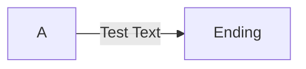

# LICENSE

* **Author**: github.com/linqiongshan

* **本作品采用 <a rel="license" href="http://creativecommons.org/licenses/by-nc-sa/4.0/">知识共享署名-非商业性使用-相同方式共享 4.0 国际许可协议</a> 进行许可**

* 

# Typora

* **官方帮助文档** [**Typora IO**](http://support.typora.io/)

## 支持的 markdown 语法

### 普通文本

### 突出文本

* \<kbd\>

  标识一个元素是 keyboard 按键，进行特殊显示。

  * 格式

    ```markdown
    <kbd>内容</kbd>
    ```

  * 示例
  
    `<kbd>CTRL</kbd>` 会被展示为 <kbd>CTRL</kbd>
  

### 流程图

集成了 mermaid ，使用 mermaid 的语法，定义路程图，比如：

```markdown
​```mermaid
graph LR
	A-->|Test Text| B[Ending]
​```
```

效果如图：



关于 mermaid 更具体的语法说明，参见其它笔记

## 功能点

### HTML 语法支持

### 基本功能

#### 快捷方式

* 设置标题级别： <kbd>Ctrl</kbd>+<kbd>1~6</kbd>

  可以快速设置标题1到标题6

* 全局搜索：<kbd>Ctrl</kbd>+<kbd>Shift</kbd>+<kbd>F</kbd>

#### 图片插入

1. 在 `文件`, `偏好设置`, `图片插入` 可与选择插入图片时，将图片保存到 md 文件所在目录，并使用本地相对路径指向图片。可以方便的将资源文件和 md 放在一起管理
2. 从其它位置复制图片后，可以直接 <kbd>Ctrl</kbd>+<kbd>C</kbd> 复制插入 md 文档

#### 全局搜索

* <kbd>Ctrl</kbd>+<kbd>Shift</kbd>+<kbd>F</kbd>
* 文件列表左下方，搜索

  

### 个性化配置

#### 添加自定义 CSS 文件

1. <kbd>文件</kbd> / <kbd>偏好设置</kbd> / <kbd>打开主题文件夹</kbd>
2. 主题文件夹下，可以放 .CSS 文件。Typora 的 CSS 文件加载顺序是
   1. Typora’s basic styles.
   2. CSS for current theme.
   3. `base.user.css` under theme folder.
   4. `{current-theme}.user.css` under theme folder. If you choose `Github` as your theme, then `github.user.css` will also be loaded.
3. 定义自己的 CSS
   1. 如果希望对所有主题都生效，可以修改 `base.user.css`
   2. 如果希望只修改特定主题，可以修改 `{theme-name}.user.css`

#### 自定义 CSS 实例

##### 标题自动编号

  ```css
  /** initialize css counter */
  #write {
    counter-reset: h1
  }
  
  h1 {
      counter-reset: h2
  }
  
  h2 {
      counter-reset: h3
  }
  
  h3 {
      counter-reset: h4
  }
  
  h4 {
      counter-reset: h5
  }
  
  h5 {
      counter-reset: h6
  }
  
  /** put counter result into headings */
  #write h1:before {
      counter-increment: h1;
      content: counter(h1) ". "
  }
  
  #write h2:before {
      counter-increment: h2;
      content: counter(h1) "." counter(h2) ". "
  }
  
  #write h3:before,
  h3.md-focus.md-heading:before /** override the default style for focused headings */ {
      counter-increment: h3;
      content: counter(h1) "." counter(h2) "." counter(h3) ". "
  }
  
  #write h4:before,
  h4.md-focus.md-heading:before {
      counter-increment: h4;
      content: counter(h1) "." counter(h2) "." counter(h3) "." counter(h4) ". "
  }
  
  #write h5:before,
  h5.md-focus.md-heading:before {
      counter-increment: h5;
      content: counter(h1) "." counter(h2) "." counter(h3) "." counter(h4) "." counter(h5) ". "
  }
  
  #write h6:before,
  h6.md-focus.md-heading:before {
      counter-increment: h6;
      content: counter(h1) "." counter(h2) "." counter(h3) "." counter(h4) "." counter(h5) "." counter(h6) ". "
  }
  
  /** override the default style for focused headings */
  #write>h3.md-focus:before,
  #write>h4.md-focus:before,
  #write>h5.md-focus:before,
  #write>h6.md-focus:before,
  h3.md-focus:before,
  h4.md-focus:before,
  h5.md-focus:before,
  h6.md-focus:before {
      color: inherit;
      border: inherit;
      border-radius: inherit;
      position: inherit;
      left:initial;
      float: none;
      top:initial;
      font-size: inherit;
      padding-left: inherit;
      padding-right: inherit;
      vertical-align: inherit;
      font-weight: inherit;
      line-height: inherit;
  }
  ```

##### `[TOC]`自动编号

```css
/**************************************
 * Header Counters in TOC
 **************************************/

/* No link underlines in TOC */
.md-toc-inner {
    text-decoration: none;
}

.md-toc-content {
    counter-reset: h1toc
}

.md-toc-h1 {
    margin-left: 0;
    font-size: 1.5rem;
    counter-reset: h2toc
}

.md-toc-h2 {
    font-size: 1.1rem;
    margin-left: 2rem;
    counter-reset: h3toc
}

.md-toc-h3 {
    margin-left: 3rem;
    font-size: .9rem;
    counter-reset: h4toc
}

.md-toc-h4 {
    margin-left: 4rem;
    font-size: .85rem;
    counter-reset: h5toc
}

.md-toc-h5 {
    margin-left: 5rem;
    font-size: .8rem;
    counter-reset: h6toc
}

.md-toc-h6 {
    margin-left: 6rem;
    font-size: .75rem;
}

.md-toc-h1:before {
    color: black;
    counter-increment: h1toc;
    content: counter(h1toc) ". "
}

.md-toc-h1 .md-toc-inner {
    margin-left: 0;
}

.md-toc-h2:before {
    color: black;
    counter-increment: h2toc;
    content: counter(h1toc) ". " counter(h2toc) ". "
}

.md-toc-h2 .md-toc-inner {
    margin-left: 0;
}

.md-toc-h3:before {
    color: black;
    counter-increment: h3toc;
    content: counter(h1toc) ". " counter(h2toc) ". " counter(h3toc) ". "
}

.md-toc-h3 .md-toc-inner {
    margin-left: 0;
}

.md-toc-h4:before {
    color: black;
    counter-increment: h4toc;
    content: counter(h1toc) ". " counter(h2toc) ". " counter(h3toc) ". " counter(h4toc) ". "
}

.md-toc-h4 .md-toc-inner {
    margin-left: 0;
}

.md-toc-h5:before {
    color: black;
    counter-increment: h5toc;
    content: counter(h1toc) ". " counter(h2toc) ". " counter(h3toc) ". " counter(h4toc) ". " counter(h5toc) ". "
}

.md-toc-h5 .md-toc-inner {
    margin-left: 0;
}

.md-toc-h6:before {
    color: black;
    counter-increment: h6toc;
    content: counter(h1toc) ". " counter(h2toc) ". " counter(h3toc) ". " counter(h4toc) ". " counter(h5toc) ". " counter(h6toc) ". "
}

.md-toc-h6 .md-toc-inner {
    margin-left: 0;
}
```

##### 侧边栏大纲自动编号

```css
.sidebar-content {
    counter-reset: h1
}

.outline-h1 {
    counter-reset: h2
}

.outline-h2 {
    counter-reset: h3
}

.outline-h3 {
    counter-reset: h4
}

.outline-h4 {
    counter-reset: h5
}

.outline-h5 {
    counter-reset: h6
}

.outline-h1>.outline-item>.outline-label:before {
    counter-increment: h1;
    content: counter(h1) ". "
}

.outline-h2>.outline-item>.outline-label:before {
    counter-increment: h2;
    content: counter(h1) "." counter(h2) ". "
}

.outline-h3>.outline-item>.outline-label:before {
    counter-increment: h3;
    content: counter(h1) "." counter(h2) "." counter(h3) ". "
}

.outline-h4>.outline-item>.outline-label:before {
    counter-increment: h4;
    content: counter(h1) "." counter(h2) "." counter(h3) "." counter(h4) ". "
}

.outline-h5>.outline-item>.outline-label:before {
    counter-increment: h5;
    content: counter(h1) "." counter(h2) "." counter(h3) "." counter(h4) "." counter(h5) ". "
}

.outline-h6>.outline-item>.outline-label:before {
    counter-increment: h6;
    content: counter(h1) "." counter(h2) "." counter(h3) "." counter(h4) "." counter(h5) "." counter(h6) ". "
}
```

##### 任务列表：已完成，待完成状态样式

```css
.task-list-done {
    /* styles for completed tasks */
    text-decoration: line-through;
}
.task-list-not-done {
    /* styles for incomplete tasks */
}
```

##### 字体自定义

* 设置字体

  ```css
  body {
    font-family: Courier;
  }
  ```

* 设置来源自网络的字体

  

# vscode

## 扩展

### psi-header / pisoniq File Header

* 用途：文件头注释生成器
* HP：<https://marketplace.visualstudio.com/items?itemName=psioniq.psi-header>

### 调用

- 添加新的头文件说明

  - thump `F1` and type `Header Insert`; or

  - type the keyboard shortcut `ctrl-alt-H` then `ctrl-alt-H`.

- 添加变更日志

  - hit `F1` and type `Header Change Log Insert`; or
  
  - type the keyboard shortcut `ctrl-alt-C ctrl-alt-C`.

### 配置

* psi-header

  - `config`: 全局配置;
  - `changes-tracking`: 变更日志;
  - `variables`: 自定义变量;
  - `lang-config`: 特定语言的配置
  - `templates`: 文件头生成模板

#### 全局配置

*psi-header.config*

* 全局配置

  | Option            | Description                                                  |
  | ----------------- | ------------------------------------------------------------ |
  | `forceToTop`      | If true, it will ignore the current cursor position and insert the header at the top of the document. If false (the default), the header will be inserted at the current cursor position. Can be overridden for specific languages (via *psi-header.lang-config*). |
  | `blankLinesAfter` | Specify how many blank lines to insert after the header comment block. Default is 0 (zero). |
  | `license`         | 版权信息，可设置成<br/>① [SPDX license ID](https://spdx.org/licenses/) <br/>②"Custom" : 使用自定义的版权声明信息，此时需要文件头模板（psi-header.templates）配置 psi-header.license-text 定义自己的版权声明模板 |
  | `author`          | Your name - used by the `author` system variable. Optional with no default. |
  | `initials`        | Your initials - used by the `initials` system variable. Optional with no default. |
  | `authorEmail`     | Your email address - used by the `authoremail` system variable. Optional with no default. |
  | `company`         | Your Company's name - used by the `company` system variable. Optional with no default. |
  | `copyrightHolder` | Your copyright name - used by the `copyrightholder`system variable. Optional with no default. |

#### 变更信息跟踪

*psi-header.changes-tracking*

变更信息跟踪不是变更日志（change log）。变更信息跟踪是记录文件的最后一次修改信息（比如被谁，在什么时候修改）

| Option          | Description                                                  |
| --------------- | ------------------------------------------------------------ |
| `isActive`      | If true, will activate changes tracking which will analyse every file during save. Default value is false. |
| `modAuthor`     | Identifies the label used on the comment line where the *modified by* value is shown. Default value is "Modified By:". |
| `modDate`       | Identifies the label used on the comment line where the *date modified* value is shown. Default value is "Last Modified:". |
| `modDateFormat` | The format string for the modified date value. Valid values are either "date" (system date - same as the `date` system variable) or a [Moment.js format string](http://momentjs.com/docs/#/displaying/format/). The default value is "date". Note that this setting is ignored if `modDate` line is based on a custom string. |
| `include`       | Defines an array of VSC language IDs for the file types to include in changes tracking. The default is an empty array which indicates any file type. |
| `includeGlob`   | Defines an array of file globs for the files to include in changes tracking. The default is an empty array which indicates any file. |
| `exclude`       | Defines an array of VSC language IDs for the file types to exclude from changes tracking. The default is an empty array which indicates no exclusions. |
| `excludeGlob`   | Defines an array of file globs for the files to exclude from changes tracking. The default is an empty array which indicates no exclusions. |
| `autoHeader`    | Determines whether the header should be added automatically to new files. Refer to the [Auto Header](https://marketplace.visualstudio.com/items?itemName=psioniq.psi-header#auto-header)section for details. |
| `replace`       | An array of template line prefixes that define additional header lines to replace during a file save. By way of example, you could use this to ensure that changes to file name or project name are always updated during save (it happens!). |

* **触发机制**

  配置 isActive 选项为 true，在文件被保存时，自动触发。isActive 默认为 false

* **信息保存逻辑-简单替换**

  psi 在触发记录变更信息时，会将信息记录到文件头注释文本中，记录规则：

  1. psi 搜索文件中的**多行**注释块，逐行查找以“特定字符串“开始的行，进行内容替换

     替换成 `languageCommentPrefix + label + newValue`

     注意，这会替换整行文本，想在替换后额外添加自定义的文本，不能使用这种方法

     > * newValue
     >
     >   根据 label 不同，newValue 也不同
     >
     >   * label 是 modAuthor 时，newValue 是 author 系统变量的值
     >   * label 是 modDate 时，newValue 是当前日期。日期格式根据 psi-header.changes-tracking.modDateFormat 配置

  2. “特定字符串”: `languageCommentPrefix + trimStart(label)`

     > * languageCommentPrefix
     >
     >   注释行的前缀，通过 psi-header.lang-config[language].prefix 配置
     >
     > * label
     >
     >   * psi-header.changes-tracking.modAuthor
     >   * psi-header.changes-tracking.modDate

  * 示例

    ```js
    "psi-header.templates": [
    	{
    		"language": "*",
    		"template": [
    			"File: <<filepath>>",
    			"Project: <<projectpath>>",
    			"Created Date: <<filecreated('dddd MMMM Do YYYY')>>",
    			"Author: <<author>>",
    			"-----",
    			"Last Modified:",  //默认的 modDate 前缀
    			"Modified By:",	   //默认的 modAuthor 前缀
    			"-----",
    			"Copyright (c) <<year>> <<company>>"
    		]
    	},
    ]
    ```

    

    

#### 自定义变量

*psi-header.variables*

```json
psi-header.variables: [
    ["变量名": "变量值"], //可以有多个
]
```

#### 文件头模板

*psi-header.templates*

* 可以使用占位符进行动态替换，替换为自定义变量或系统变量等。
  * 占位符格式： <<变量名>>
* 支持的选项
  * templates 必须包含 mapTo 和 template 中的一个。如果 language 设置为 "*" ，则 mapTo 配置会被忽略

| Option                     | Description                                                  |
| -------------------------- | ------------------------------------------------------------ |
| `language`                 | Mandatory. Either the VSCode language ID or '*' for the global template. |
| `mapTo`                    | Optional. If provided, this language will use the specified language's template (and will ignore the following *template* value). The value is a VSCode language ID. You can not `mapTo` a language that itself has the `mapTo`value set. Ignored if *_language = "*"_*. |
| `template`                 | This must be provided if *mapTo* is not declared. Includes an array of strings that represent the body of the header. No need to include the comment block syntax. |
| `changeLogCaption`         | Mandatory if using the [Change Log](https://marketplace.visualstudio.com/items?itemName=psioniq.psi-header#change-log) feature. Defines the caption for the change log that must also appear in the main header template. The extension uses this caption to work out where to place a new change log entry. |
| `changeLogHeaderLineCount` | Used in the [Change Log](https://marketplace.visualstudio.com/items?itemName=psioniq.psi-header#change-log) feature to define the number of lines in the main template between the above *changeLogCaption* and the log entries. This can be used to configure the main template to include column headings for the change log. Defaults to 0 if not provided. |
| `changeLogItemTemplate`    | The template for a change log entry. Allows overriding of the default item template. |
| `psi-header.license-text`  | Optional. The license text to use where *psi-header.config.license = "Custom"*. |

#### 语言特定配置

*psi-header.lang-config*

可以对特定语言，修改特定的配置项。本文不详细记录。需要使用时，请参考 [官方手册](<https://marketplace.visualstudio.com/items?itemName=psioniq.psi-header>) Language Configuration 章节

#### psi-header 内置对象

##### 系统变量

系统变量变量名不区分大小写

| Variable Name      | Description                                                  |
| ------------------ | ------------------------------------------------------------ |
| `date`             | The current date using the current locale (also see the `dateformat()` [system function](https://marketplace.visualstudio.com/items?itemName=psioniq.psi-header#system-function) below for a formattable date string version). |
| `time`             | The current time using the current locale.                   |
| `year`             | The current year.                                            |
| `filepath`         | The fully-qualified name of the file.                        |
| `filerelativepath` | The file name including the relative path within the project. |
| `filename`         | Just the file name without the path details.                 |
| `projectpath`      | The fully-qualified path to the root directory of the project. |
| `projectname`      | Attempts to read package.json (in the current or any parent directory) for either a `displayName` or `name`property. If there is no package.json file *and* the file has been saved to disk, it will return the project path's base name. |
| `company`          | The name of your company. In this release it defaults to "Your Company". |
| `author`           | Will attempt to get the user name of the current user, otherwise it defaults to "You". |
| `initials`         | Your initials (where you don't want the whole author name    |
| `authoremail`      | The email address of the file author. In this release it defaults to "you@you.you". |
| `licensetext`      | The full text of the license. This is determined automatically. |
| `copyrightholder`  | Used in some licenses. If not provided it defaults to the same value as `company`. |
| `licensename`      | The name of the license. If not using a custom license, this is determined automatically. |
| `licenseurl`       | The url for the license. If using not using a license, this is determined automatically. |
| `spdxid`           | The SPDX License ID for the license. If not using a custom license, this is determined automatically. |

##### 系统函数

系统函数区分大小写

| Function Name       | Description                                                  |
| ------------------- | ------------------------------------------------------------ |
| `dateformat(args)`  | The current date or date part using format strings. This function takes a single string argument which represents the moment.js compatible format string. |
| `filecreated(args)` | The file created date and time using format strings. This function takes a single string argument which represents the moment.js compatible format string (surrounded in single or double quotes). It can also be called without arguments to use the current locale date format. If the file created date cannot be determined it will return the current date and time (usually because the file has not yet been saved to disk, or the operating system failed to return the creation date and time). |

* 日期格式字符串： Typora 使用 moment.js 处理日期格式，因此格式字符串的格式就是 moment.js 支持的格式

  [moment.js](<http://momentjs.com/docs/#/displaying/format/>)

  * **Year, month, and day tokens**

    *Tokens are case-sensitive.*
  
    | Input      | Example          | Description                                            |
    | :--------- | :--------------- | :----------------------------------------------------- |
    | `YYYY`     | `2014`           | 4 or 2 digit year                                      |
    | `YY`       | `14`             | 2 digit year                                           |
    | `Y`        | `-25`            | Year with any number of digits and sign                |
    | `Q`        | `1..4`           | Quarter of year. Sets month to first month in quarter. |
    | `M MM`     | `1..12`          | Month number                                           |
    | `MMM MMMM` | `Jan..December`  | Month name in locale set by `moment.locale()`          |
    | `D DD`     | `1..31`          | Day of month                                           |
    | `Do`       | `1st..31st`      | Day of month with ordinal                              |
    | `DDD DDDD` | `1..365`         | Day of year                                            |
    | `X`        | `1410715640.579` | Unix timestamp                                         |
    | `x`        | `1410715640579`  | Unix ms timestamp                                      |

    `YYYY` from version **2.10.5** supports 2 digit years, and converts them to a year near 2000 (same as `YY`).
  
    `Y` was added in **2.11.1**. It will match any number, signed or unsigned. It is useful for years that are not 4 digits or are before the common era. It can be used for any year.
  
  * **Week year, week, and weekday tokens**
  
    For these, the lowercase tokens use the locale aware week start days, and the uppercase tokens use the [ISO week date](https://en.wikipedia.org/wiki/ISO_week_date) start days.
  
    *Tokens are case-sensitive.*
  
    | Input      | Example        | Description                                 |
    | :--------- | :------------- | :------------------------------------------ |
    | `gggg`     | `2014`         | Locale 4 digit week year                    |
    | `gg`       | `14`           | Locale 2 digit week year                    |
    | `w ww`     | `1..53`        | Locale week of year                         |
    | `e`        | `0..6`         | Locale day of week                          |
    | `ddd dddd` | `Mon...Sunday` | Day name in locale set by `moment.locale()` |
    | `GGGG`     | `2014`         | ISO 4 digit week year                       |
    | `GG`       | `14`           | ISO 2 digit week year                       |
    | `W WW`     | `1..53`        | ISO week of year                            |
    | `E`        | `1..7`         | ISO day of week                             |

  * **Locale aware formats**

    Locale aware date and time formats are also available using `LT LTS L LL LLL LLLL`. They were added in version **2.2.1**, except `LTS` which was added **2.8.4**.

    *Tokens are case-sensitive.*
  
    | Input  | Example                              | Description                                       |
    | :----- | :----------------------------------- | :------------------------------------------------ |
    | `L`    | `04/09/1986`                         | Date (in local format)                            |
    | `LL`   | `September 4 1986`                   | Month name, day of month, year                    |
    | `LLL`  | `September 4 1986 8:30 PM`           | Month name, day of month, year, time              |
    | `LLLL` | `Thursday, September 4 1986 8:30 PM` | Day of week, month name, day of month, year, time |
    | `LT`   | `08:30 PM`                           | Time (without seconds)                            |
    | `LTS`  | `08:30:00 PM`                        | Time (with seconds)                               |

  * **Hour, minute, second, millisecond, and offset tokens**

    *Tokens are case-sensitive.*
  
    | Input      | Example  | Description                                                  |
    | :--------- | :------- | :----------------------------------------------------------- |
    | `H HH`     | `0..23`  | Hours (24 hour time)                                         |
    | `h hh`     | `1..12`  | Hours (12 hour time used with `a A`.)                        |
    | `k kk`     | `1..24`  | Hours (24 hour time from 1 to 24)                            |
    | `a A`      | `am pm`  | Post or ante meridiem (Note the one character `a p` are also considered valid) |
    | `m mm`     | `0..59`  | Minutes                                                      |
    | `s ss`     | `0..59`  | Seconds                                                      |
    | `S SS SSS` | `0..999` | Fractional seconds                                           |
    | `Z ZZ`     | `+12:00` | Offset from UTC as `+-HH:mm`, `+-HHmm`, or `Z`               |
  
    From version **2.10.5**: fractional second tokens length 4 up to 9 can parse any number of digits, but will only consider the top 3 (milliseconds). Use if you have the time printed with many fractional digits and want to consume the input.
  
    Note that the number of `S` characters provided is only relevant when parsing in strict mode. In standard mode, `S`, `SS`, `SSS`, `SSSS` are all equivalent, and interpreted as fractions of a second. For example, `.12` is always 120 milliseconds, passing `SS` will not cause it to be interpreted as 12 milliseconds.
  
    `Z ZZ` were added in version **1.2.0**.
  
    `S SS SSS` were added in version **1.6.0**.
  
    `X` was added in version **2.0.0**.
  
    `k kk` was added in version **2.18.0**
  
    Unless you specify a time zone offset, parsing a string will create a date in the current time zone.
  
    ```js
    moment("2010-10-20 4:30",       "YYYY-MM-DD HH:mm");   // parsed as 4:30 local time
    moment("2010-10-20 4:30 +0000", "YYYY-MM-DD HH:mm Z"); // parsed as 4:30 UTC
    ```
  
    If the moment that results from the parsed input does not exist, `moment#isValid` will return false.
  
    ```js
    moment("2010 13",           "YYYY MM").isValid();     // false (not a real month)
    moment("2010 11 31",        "YYYY MM DD").isValid();  // false (not a real day)
    moment("2010 2 29",         "YYYY MM DD").isValid();  // false (not a leap year)
    moment("2010 notamonth 29", "YYYY MMM DD").isValid(); // false (not a real month name)
    ```